## 0. Table of Contents
1. Background  
* the whats and whys of version controls systems. 

2. Git Setup and Configuration
* setting up git 
* git config

3. Basic Git Workflow - Locally 
 * blobs and trees
 * git init and .git 
 * git add 
 * git status
 * git commit 
 * git log 
 * git reset, git restore, and git revert

4. Branching 
* git branch 
* git checkout 
* -b, -m, and -d
* git stash 

5. Merging
* git merge 
* merge conflicts 
* resolving merge conflicts 

6. Git's Data Model 
    * relating snapshots
    * git objects
    * object representation
    * SHA-1 hash
    * references

7. Remote Repositories
* what github is
* private vs public repositories
* README.md
* .gitignore
* git remote
* git push 
* git clone 
* --branch, --depth 
* git fetch 
* git pull 
* git revert 
* pull requests

8. Rebasing Branches
* git rebase
* rebase vs merge

9. Sources and Further Reading 

<br/><br/>

## 1. Background  

In this module, we will dive into an often overlooked, yet extremely crucial aspect of software design: version controls systems (VCSs). A VCS tracks the history of changes to a file or set of files over time. The most common type is a centralized VCS, which uses a server to store all the versions of a file. Some common VCSs include `Mercurial`, `Apache Subversion `, and `Beanstock`, but the reigning champion of version control and VCS used in this module is `Git`. Although Git is underlyingly beautiful, its user interface is a leaky abstraction: its tidiness and simplicity doesn't hide the details it is meant to hide, often leading to confusion and misunderstandings amongst users. Hopefully this module will clear the air with Git, enabling you fully understand what is happening the next time you commit code.  

***Why should I care about VCSs?*** <br/>
In a collaborative setting, it is extemely important to know the whos, whens and whys of a project for effiency and debugging purposes. By allowing teams to upload files,  access corresponding metadata, quickly compare versions, and even restore a previous version, VCSs have become a necessity in all modern team-based software development settings. Even when working individually, VCSs can help you remember why something was changed, and give you the ability to work in parallel on different features. 

<br/><br/>

## 2. Git Setup and Configuration 

If you have never used Git before, use this [link](https://git-scm.com/book/en/v2/Getting-Started-Installing-Git) and install Git for your operating system. To ensure correct installation of git, run `git --version` in your terminal, and you should see the version number of Git you just installed. 

Now let's set our credentials so our identity is linked to our changes. There are 3 different configuration levels for Git: 
1. System-wide: configurations will apply to all users on that device's repositories.

2. Globally: configurations will apply to only the current logged in user's repositories.

3. Locally: configurations will only apply to the working repository.

To set up your name or email globally for Git, use the following commands:
```bash
git config --global user.email "youremail@ucsb.edu"
git config --global user.name "yourname"
```
Try running `git config list` to see your system, global, and (if inside a repository) local configs. 

<br/><br/>

## 3. Basic Git Workflow - Locally 

Lets look at how to create a new project and allow for git to track it locally. First, copy and paste the block of commands in your terminal from your prefered workspace directory and hit enter: 
```bash 
mkdir git_test && \
cd git_test && \
touch file1.txt && \
mkdir foo && \
touch foo/file2.txt 
```
***What did I just do?*** <br/>
You created a file structure inside your prefered directory that looks like:

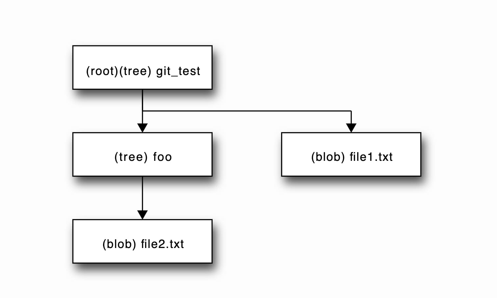

In Git, a file is also called `blob` and a directory is called a `tree`. 

Now lets initialize git so we can track git_test and all of its contents:
```bash 
git init 
```
The `git init` command does not save immediately save a version of  git_test, but instead creates a folder called `.git` inside the root folder that will eventually be full of files and subdirectories that will hold all metadata that Git needs to track the project. Now our file structure looks like: 

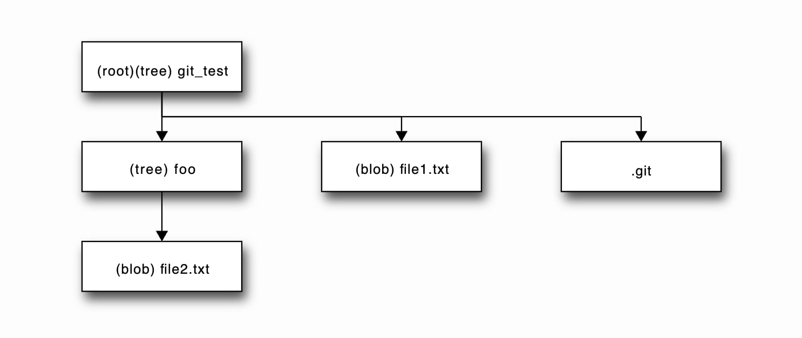

***Why can't I find a .git file under git_test?*** <br/>
Hidden files, (they usually files that start with a .), are helpful in preventing accidental deletion of important data. The user should not interact with the metadata git is storing, so it makes sense for it to be hidden. However, you can run `ls -a` to see visible and invisible files and directories. 

Now our project has an empty .git, ready to track the state of our project. Now enter the following command in your git_test (root) directory: 
```bash
git add .
```
Now all blobs and trees in the git_test directory are being tracked by Git in the .git file. Note the . after add. This indicates we want git to track everything modified or added from our current root directory. If, for example, I only wanted to start tracking file2.txt, I would type `git add foo/file2.txt`.  To verify these results, try:
```bash 
git status 
```
Git status is extremely useful. It shows, which files being tracked (also called staged files or changes to be committed), which files are not being tracked (changes not staged for commit) and also commits as well as which branch you are working on (we will get to this).


Now lets create a `snapshot` of git_test. A `snapshot` is just a manifest of what all of the tracked blobs and trees in your project look like at that point. The most recent snapshot of your repository is called the `HEAD`, which dynamically changes as you create snapshots through `commits`. To take a snapshot of git_test, run the following command from the git_test directory: 
```bash 
git commit -m "<yourinitials> - Initial commit"
```
***What is this -m and message?*** <br/>
The `-m` flag allows you to tag a message associated with your snapshot, which can be extremely useful when debugging, as it allows you to remember what you specifically accomplished in that snapshot. It is also good idea to put your initials in team settings, so others can easily spot who made the commit. Making these as descriptive as possible can save alot of time.

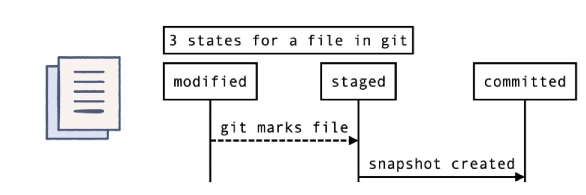

Let's create another snapchat. In your terminal from your git_test directory enter: 
```
echo "Hello, Git" >> file1.txt
```
Then create another snapshot by first adding and then commiting, this time with message Added Hello, Git to file1.txt.
```
git add . && \
git commit -m "<yourinitials> - Added Hello, Git to file1.txt"
```

Entering the command `git log` into your terminal should now show you both your snapshots (or commits) chronologically ordered: complete with the current HEAD, author, timestamp, and even commit messages of your snapshots. `git log` is also extremely useful in collaborative settings, since it also shows the snapshots of all contributors. Hit q to quit the git log process. 
<br/>


***What is this 40 character long string of characters next to my commit when I run git log?*** <br/>
Good question, we will take a look at that in the Git's Data Model section.

Great. We can now update our code and save it as snapshots as we go along and add features. But what if we make a mistake? A few example of what a mistake could be is: deleting a file, creating a bug or accidently running `rm -rf *` in the source directory instead of the build directory. Part of why we we're using a VCS is to be able to fix these problems quickly, and sure enough, Git provides a multitude of way to do so. Let's look at one common approach to fixing our mistake. First lets pretend we accidently wiped out our entire git_test project, and then staged and committed our code. For convience, you can copy the follow commands and enter them from git_test: 
```bash 
rm -rf * && \
git add . && \
git commit -m "Accidently deleting my whole project" 
```
Run `ls` then `git log` to make sure your git_test directory is empty and the commit where you deleted everything exists. We will now use `git reset` along with some tags to revert back to an old commit. It worth mentioning running just `git reset`  will unstage all files (or a few depending if file paths are specified). There are two main routes we using `git reset`:

1. using the `--soft flag` changes the state of most recently commited files to staged, so all changes made are preserved. 
2. using the `--hard flag` completely gets rid of the most recently commited files, so all changes made are lost. 

For our example, lets use the hard flag. Enter this command this from your git_test repository:
```bash
git reset --hard HEAD~1
```
Let's first break this the `HEAD~1` arguement down. `HEAD`refers to what we want to reset (the most recent snapshot). The `~1` indicates how many commit back we want to go. Putting these together `HEAD~1` means we want the new `HEAD` to be the commit 1 before the original `HEAD`. After running this command, you should see all the expected files from the last commit are back in git_test. Note that running `git log` no longer shows the commit in where we deleted everything.

***What is the difference between git reset, git restore and git revert?*** <br/>
The use cases somewhat overlap but their are subtle differences. `git reset` is about updating your branch by moving the HEAD to a previous commit, losing the original commit in the process of doing so. It is also used to restore staged files (this overlaps with git restore). `git restore` is about restoring files from either the staged area or from another commit. `git revert` is about making a new commit that reverts changes made by other commits. Note that git revert and git reset alter git history, whereas restore does not. 

Awesome. You can now locally use git to save snapshots of you projects and if you do make a mistake, it's not the end of the world. 

<br/><br/>

## 4. Branching 
Imagine you are working on a website with a team. You are in the midst of implementing a new "contact us" page when your CEO, Steve Zuckerberg, tells you the login button is broken for all users and you need to fix it immediately. You could reset back to when the login button was implemented, but then what happens to your "contact us" page work? Fortunately, Git's data model is not linear: you can split off from a commit. 

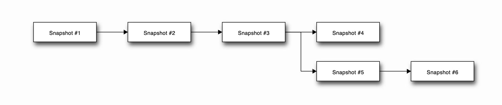

In the above diagram, snapshots 1-4 as being apart of the default branch `master`, given to your branch from the very first commit. Let's say snapshot 5-6 are on branch develop. You can work freely on branch develop without affecting the source code in the master branch. What Git is actually doing when you create a branch is creating a new pointer or `reference` (more on this in Git's data model) to you current snapshot or commit. Note that you can also branch off of any other branch. 

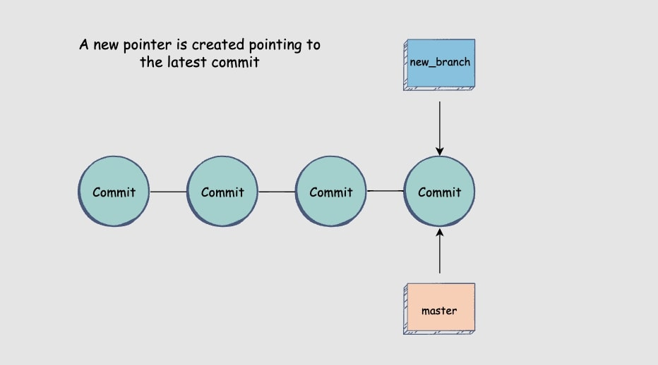

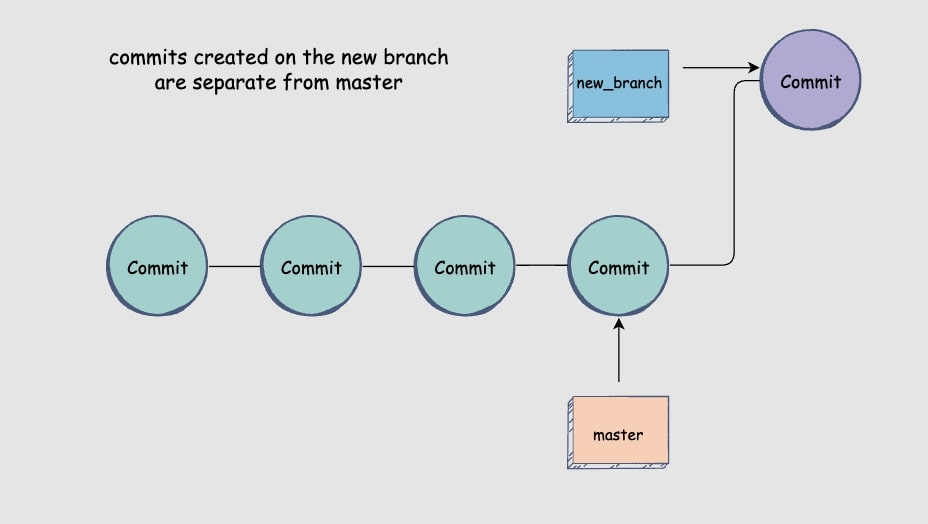

Now lets get into an example. First navigate to the previous `git_test` repo from chapter 4, and enter in your terminal:
```bash 
git branch
```
This command prints out all branches present in the repostiory (which for this example should just be the default master) and also which branch we are on, indicated by an asterisk. Now lets create a new branch called develop by entering the following command: 
```bash 
git branch develop
```
Now run `git branch` and you will see a new reference `develop`. However, you may notice that our current branch is still `master`. To switch to our newly created branch, we need to run:
```bash 
git checkout develop
```
Try running `git branch` again, and the asterisk should now be next to `develop`. The `git checkout` command provides us a convient way to implicitly create and switch to a branch by using a `-b` flag. Enter the following into your terminal:
```bash 
git checkout -b branch3
```
Now run `git branch` to verify results. Let's now create a change and see what happens. Now that lets create a new commit on the `develop` branch that adds `file3.txt`.
```bash 
git checkout develop && \
touch file3.txt && \
git add . && \
git commit -m "Adding file3.txt to branch develop"
```
Now try checking out the `master` branch and note that there is no `file3.txt`. 

***What if I want to rename a branch?*** <br/>
To a branch your are currently on you can use `git branch -m newName`. If you want to rename another branch from wherever, use `git branch -m oldName newName`.

Now lets go ahead and delete branch3. The straightforward syntax is:
```bash 
git branch -d branch3
```
Verify branch3 no longer exists with `git branch`.

Now checkout out to develop and create a `file4.txt`;
```bash 
git checkout develop && \
touch file4.txt 
```
Let's pretend file4.txt is an incomplete feature and is not ready to be even be commited. Your boss just old you to change a button from red to dark red immediately or else you are fired. You know you can checkout to the master branch and change it, but you do not want to lose all your progress. This situation is when `git stash` is useful. `git stash` temporarily stores the staged and modified file in a cache, making the working branch clean, allowing for proper branch switching. Let's see `git stash` in action, make sure you are on branch develop and enter:
```bash 
git add . && \
git stash && \
git checkout master 
```
Now you would make the needed changes to master. Enter the following:
```bash 
touch file5.txt && \
git add . && \
git commit -m "Adding file5.txt to branch master"
```
To resume progress on `develop` enter: 
```bash 
git checkout develop && \
git stash apply 
```
Run `git status` to ensure all files are back.  Let's go ahead and create another commit on the develop branch and master branch before we dive into merging branches.
```bash
git commit -m "Adding file4.txt to branch develop" 
```

<br/><br/>

## 5. Merging 
A quick sanity check.

Our `git_test` directory on branch `develop` has 4 total commits and `HEAD` looks like: 

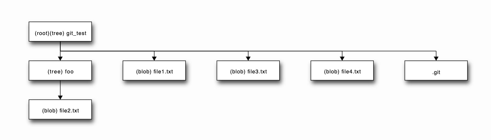

Our `git_test` directory on branch `master` has 3 total commits and `HEAD` looks like: 

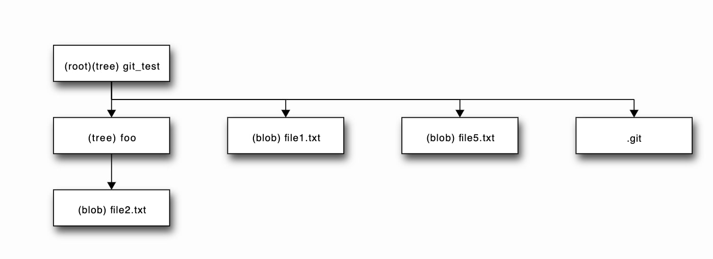


Our `git_test` commit history looks like: 

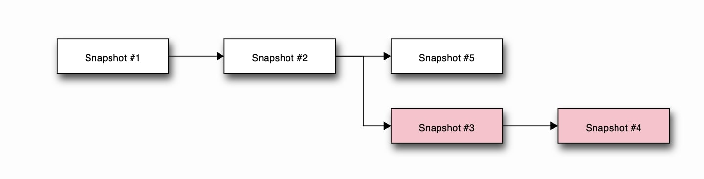

Now we will merge the develop branch into the master branch using `git merge`. Although the commit history is different for our master and develop branch, we can create what is called a `merge commit` that is representative of all changes from develop and master branches. Once a merge commit is created, the history of the snapshots in the merged branch will also become apart of the branch that it is merged with. 

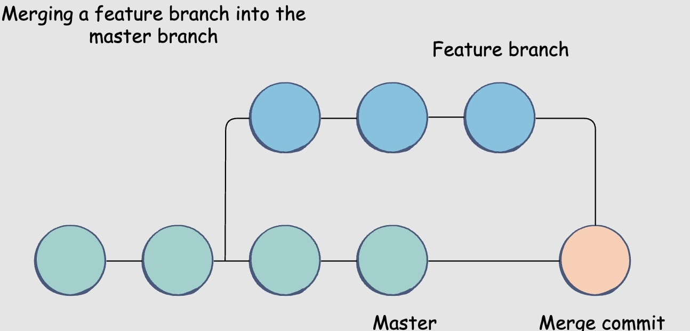

To merge `develop` into `master` we first need to checkout master. Do so by entering: 
```bash 
git checkout master
```
Now that we are on the branch that will contain our merge, we can run: 
```bash 
git merge develop
```
A text file might open that asks to type in a merge commit message. Type:   `Adding feature from develop to master` then close the file to complete the merge. Verify that both the `master` and `develop` `references` point to the merge commit by using `git log`. Then verify that your git_test directory looks like: 

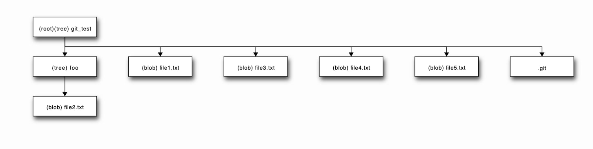

Since `master` now contains the commit history of `develop`, it is safe to delete `develop`. Do so by entering: 
```bash 
git branch -d develop
```
Run `git log` to verify the commits made in develop still exist. 

But what if two branches make changes to the same file? Copy and the paste the following command block from your git_test directory to setup an instance where this occurs: 
```bash 
git branch develop && \
echo 'I love Merge Conflicts' >> file2.txt && \
git add . && \
git commit -m "Adding I love Merge Conflicts to file2.txt on master branch" && \
git checkout develop && \
echo 'I hate Merge Conflicts' >> file2.txt && \
git add . && \
git commit -m "Adding I Hate Merge Conflicts to file2.txt on master branch" && \
git checkout master
```


There is a merge conflict after running these commands since you:
1. Created a new branch called `develop` (again)
2. Changed `file2.txt` on master to contain "I love Merge Conflicts" and committed
3. Switched to branch develop 
4. Changed `file2.txt` on develop to contain "I hate Merge Conflicts" and committed
5. Switched back to branch master

The commit created on master after the branch is conflicting with the commit on develop. Try and merge with:
```bash 
git merge develop
```
And you should see that the merge failed because of file2.txt. Git helps us identify what the conflict is by using a special syntax. To see this syntax, enter:
```bash 
open file2.txt
```
and you should see: 
```text 
<<<<<<< HEAD
I love Merge Conflicts
=======
I hate Merge Conflicts
>>>>>>> develop
```
It should look contain what the conflict is in the  `HEAD`'s file2.txt (where we currently are) and also what in `develop`'s file2.txt, separated by a line of `=======`s. Now edit this file, removing all the unecessary git syntax, only leaving what you want to keep. For us, edit the file to say 
```text 
I hate Merge Conflicts
```
Now let's stage and commit our changes with:
```bash 
git add file2.txt && \
git commit -m "Fixed merge conflict in file2.txt"
```
Type `git log` and you will see this commit has a special line that startes with `merge` that indicates which two commits were merged. 


<br/><br/>

## 6. Git's data model
*Note: this section is noninteractive.*

Now lets dive a little deeper into how that aforementioned .git file is actually relating and storing all these snapshots from potentially multiple branches. A history of a repositoritory is a directed acyclic (no-cycle) graph (or DAG for short) of snapshots, where each snapshot refers to a set of parent snapshots that precede it. When two branches merge is an example of when one snapshot will have 2 parents. Let's quickly look at an example DAG commit history, where the arrows represent the chronology of snapshots. 


In the above example, all snapshots have only 1 parent in their set: the snapshot before itself. In this example, let's say snapshots 1-4 are on branch master, whereas snapshots 5-6 are on branch development. Let's create a merge commit. Now our commit history looks like: 

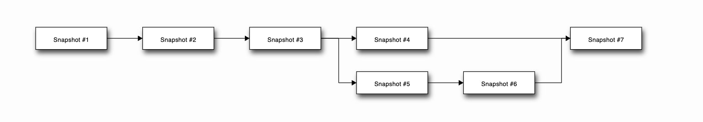
Now snapshot #7 has two parents associated with itself: snapshot #6 and snapshot #4. Commits in git are immutable: edits to the commit history either create new commits or update references to point to other commits (we will get to references in a second).

Now that we understand how snapshots are related, lets get into Git's underlying data structure by using UCSB's language of choice, C++, as a modeling tool. Note that a blob (or file) is an array of bytes and a tree (or folder) is a map to either blob or another tree. Keep in mind the below representation is a model. 
```c++
//A blob is an array or vector of bytes
struct blob {
    vector<bytes> ablob;
}
//A tree is a map that contains more trees and/or blobs
struct tree {
    vector<blob> blobsInTree;
    map<string, vector<string> > treesInTree;
    
}
//A commit is a set of parents, a string author, a string message, and a tree  
struct commit {
    set<tree> parents;
    string author;
    string message;
    tree snapshot; //this is the top level tree
}
```
These `blob`. `tree`, and `commit` data types are all `objects` in the eyes of Git. If you add a blob or tree or create a commit, Git uses what's called a `SHA-1 hash` to idenitfy each object for storing and loading. Even when objects reference other objects, they don’t actually contain them in their on-disk representation, but instead use the other objects hash as a reference. The `SHA-1 hash` is literally a string of 40 hexadecimal characters, and is used since it is a secure and integral way to a uniquely content-address each object. Read more about SHA-1 hashing [here](https://www.geeksforgeeks.org/sha-1-hash-in-java/). 

Most people have trouble memorizing 40 hexadecimal character, so git came up with the idea of `references`. `References` are like C++ pointers, but they only`point to commits`. References are mutable: they can be updated to point to a new commit (unlike objects). An example of a reference is the `master` or `main` branch that usually points to the latest production ready commit. Remember early when we used `git reset --hard HEAD~1`? What we were actually doing was changing the "where we currently are" reference, or `HEAD` to point to a previous commit. You can also substiute `HEAD~1` with any commit. Lets say we are on the master branch and want the `master` ref to point to commit `6f21v1e`, and we do not care about uncommited changes. We could would enter the follow from our root directory:
 ```bash
 git reset --hard 6f21v1e
 ```

<br/><br/>

## 7. Remote Repositories
So far we have talked about using the `git` command line locally to create a version history of our project, but how can we make this project accessible to other people who want to contribute? This is where remote repositories come into play. Remote repositories allow developers to have a unified source of truth for their source code. It is worth noting there are several Git providers, such as `GitLab` and `BitBucket`, but we will focus on the most popular code hosting platform, `GitHub`. 

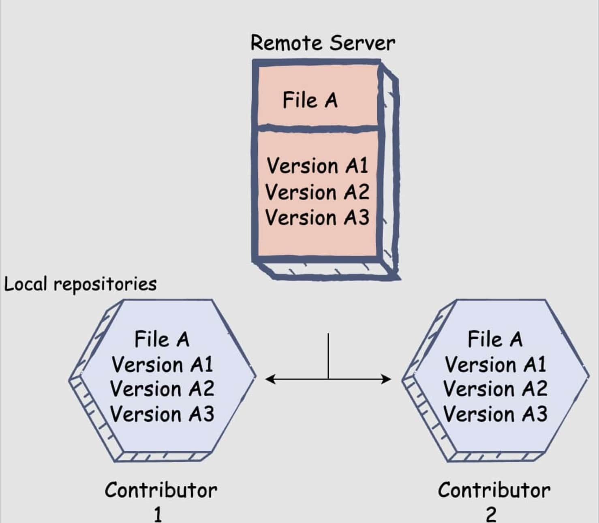

If you do not already have a GitHub account, sign up for one [here](https://github.com/). It is reccomended by `GitHub` to have one account for all personal, school, or professional matters.

Now lets create a repository of our git_test folder. Hit the green `new` button near the top left side, and you will be redirected to a page asking for some parameters.  Note that steps 4 and 5 should be skipped if your importing an existing repository, which we are doing in this module.
1. For repository name put `Git-Test`.
2. For description put `Experimenting with GitHub`
3. You can decide whether to be public or private. As the names suggest:
* A `public repository` is accesible for anyone to see and clone on their local machine
* A `private repository` is only visible and cloneable to people you give permissions to. 
For this repo, it might make more sense to be private.
4. You can decide whether to add a `README.md` file. `README.md` files contain necessary information about the repository such as instructions on how to clone and run source code locally, how to use the codebase, how to workaround bugs, or even contact information about people who contributed to the codebase. 
5. You can decide whether to add a `.gitignore` file. The purpose of this file is to filter out files and subdirectories in your repository that you do not want Git to keep track of: files contained in a `.gitignore` file will not be marked as modified, staged, or committed by Git. Git offers some templates for you containing commonly ignored files. 
6. You can decide whether to add a `license`. This tells others what they can and cannot do with your code. 

For this example, remember to not add a `README.md` or a `.gitignore`. Now hit the create button and you should see an empty repository with a few suggestions for `GitHub` with how to get started. Since we want to get our local repository on GitHub, we will be linking our `local` git_test repository with the newly created Git-Test `remote` repo. Once we link them, we can then `push` our code from the git_test to Git-Test. 

To link git_test and Git-Test, enter the following command in your terminal from your git_test directory. 
```bash 
git remote add origin URL-TO-YOUR-REMOTE-REPO
```
The link to your remote repository is listed near the top of your Git-Test page. 

***What does origin mean?*** <br/>
`origin` is the name we chose to name our url to our remote repo for simplicity later: we can just use `origin` instead of using the actual URL.  `origin` is the conventional name, but it can be anything. 

Once we have the two repositories linked, let's push our local code and it's revision history to the remote repo using `git push`. This command essentially pushes all updates that were made in the local repository for a specific branch. You can create several commits before pushing to the remote. The syntax in our case is as follows:
```bash 
git push origin master 
```
Note that `origin` can be any remote name and `master` can be whatever branch we are updating. Verify that on your Git-Test remote repository, there now exists our example source code. But what if we start from an already existing remote repo?

If we want to copy and clone an entire codebase of a project from a remote repository and set it up as a local repository on our machine, we can use `git clone`. When using `git clone` to copy a project, two other actions are occuring:
1. Essentially `git remote add origin <url>` is run as a subcommand of `git clone`, automatically linking the local and remote repositories. 
2. It copies and sets up the primary branch, which is usually set as the `master` in most directories. 

Now that we have pushed our commit history to a remote repository, let's delete our local copy and clone it back to further understand the cloning process. Navigate to git_test on your local machine and enter the following commands. MAKE SURE YOU ARE IN YOUR GIT_TEST REPO. When making this I accidently deleted my entire desktop. 
```bash
find . -name . -o -prune -exec rm -rf -- {} + && \
cd .. && \
rmdir git_test
```
The find command is complicated but it ensure hidden files and the `.git` metadata is deleted. And then to clone your remote repository run:
```bash 
git clone URL-TO-YOUR-REMOTE-REPO
```
Try out `git log` and notice now there exists a `origin/master` and `origin/HEAD` reference. Keep in mind the `HEAD` is the latest snapchat of the branch you are on.


***What if I want to clone a particular branch?*** <br/>
You can clone a particular branch with `git clone --branch BRANCH_NAME URL-TO-YOUR-REMOTE-REPO`

***What if I don't want to clone a project's entire commit history?*** <br/>
For super big projects, cloning the entire commit history can take a long time. By using a `depth` flag, we can clone a commit history up to a certain point. The full command looks like: `git clone URL-TO-YOUR-REMOTE-REPO --depth DEPTH-NUMBER`

Now let's talk about getting changes from the remote after cloning it. Imagine you just cloned the master branch and are working on a new feature. A few days go by and you want to know how the remote repository has updated since you cloned it. To download the changes without affecting your local codebase, you can use `git fetch`. This essentially is updating the `origin/master` reference, allowing you to see the lastest commit history. Lets see this in action. First go to your Git-Test remote repository on GitHub and: 
```
Click the green `Add a README` button. 
Select the `commit direct to master branch` option and then commit the file. 
```
The remote repo master branch is now 1 commit ahead of our local copy.
Now head to your now named Git-Test directory in terminal and enter:
```bash 
git fetch origin
```
Now let's checkout the `origin/master` branch we just fetched by entering: 
```bash 
git checkout origin/master
```
And now you should see the `README.md`. Note that this a detached head state since we are checking out the remote branch. 

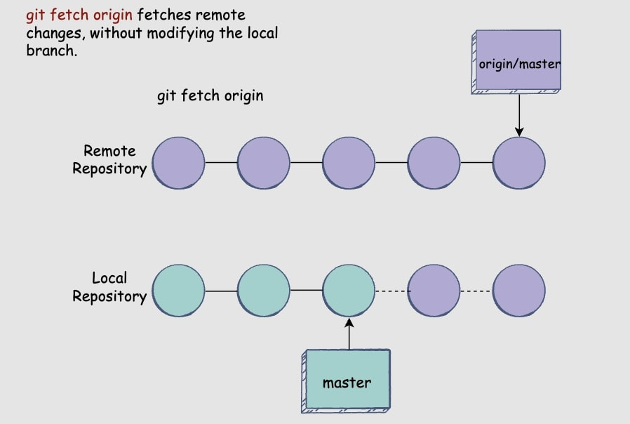

Before we merge the remote branch, we need to go back to our local branch state by entering 
```bash 
git checkout master
```
To merge our fetched changes, we now can run: 
```bash 
git merge origin/master
```
And now verify the changes in the remote are merged with the local one. 

There exists a commonly-used command called `git pull` that essentially combines `git fetch` with `git merge origin/BRANCH-NAME`. This is the perfect command for updating your codebase with completed features. To test this command, go ahead and add a new file from your GitHub Git-Test remote by clicking the `Add File` near the top of your repo followed by the `Create A File`. Name your file file6.txt and commit it directly to master. Now enter in your local Git-Test directory in terminal: 
```bash 
git pull origin master 
```
And you should see file6.txt locally.

***How do I revert to an old commit on a remote repo?*** <br/>
The git reset command's use cases are typically local, since changing the `HEAD` would result in a history conflict with everyone who had a clone the repository. Instead it would be a much better idea to use the aforementioned `git revert` since it will add another commit on top of flawed one that essentially will undo the problem. Example syntax is `git revert HEAD~1`.


The last thing that needs mentioning is `pull requests`. A `pull request` is a formal way to contribute to a codebase without disrupting the workflow of other contributors. Here are some other notes about `PR`s:
1. They are the intermediate step between two branches merging 
2. They display the list of commits and branch that will merged
3. They allow for contributors to review code and discuss changes 
4. They display the files changed and what specific lines were changed
5. They are user friendly 
<br/><br/>

Let's quickly set up an example so we can create a PR from branch `develop` to branch `master`. Enter the following commands in your terminal from your Git-Test directory:  
```bash 
git checkout -b develop && \
echo 'I love Git' >> file3.txt && \
git add . && \
git commit -m "Adding I love Git to file3.txt" && \
git push origin develop
```
Now head back to your `GitHub` repository and either click the `Compare & pull request` green button, or navigate to the develop branch and click the `Contribute` drop-down menu and then click `Open Pull Request`. After doing so, you are given the option to Title and give a description for your PR. It is good practice, especially when working in a team, to make both of these as descriptive as possible. Focus less on the technical detailed and ask yourself what this PR means for the potential user or other developers who may be involved. Then enter `Create Pull Request`.  Try and become familiar with this interface. There are alot of buttons and things you can do on this page, most of which we won't get into since they are pretty straightforward. Be sure to check out the `files changed` tab to see what was changed in this PR. Verify file3.txt was changed and that `I love Git` was added to it. In a team setting, other members would review your PR before merging, but in case, just merge your own PR by clicking the green button labeled `merge pull request`. Once merged, it is safe to delete the branch since, as we know, the merge commit contains the history of the branch. 

## 8. Rebasing Branches
Imagine you create out a new branch called `develop` from `master` and both branches are pushing new commits and you want to link the latest version of the master branch with your branch (reference below image). To do this, git provides a `git rebase` command.

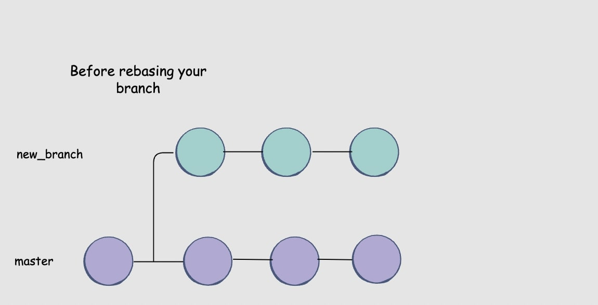

Let's get into an example. To setup this situation, copy the below code from your previous Git-Test directory from on branch develop:
```bash
touch file6.txt && \
git add . && \
git commit -m "Adding file6.txt on branch develop" && \
git checkout master && \
touch file7.txt && \
git add . && \
git commit -m "Adding file7.txt on branch master" && \
git checkout develop
```
Essentially this above code just creates a commit on the master and develop branch. You should be on the `develop` branch. Now try running: 
```
git rebase master
```
Run `git log` and look at where the references point now: the develop commit. Run `ls` on develop and notice file7.txt from the master snapshot. The below image should also give insight into what the Git-Test commit history should look like.

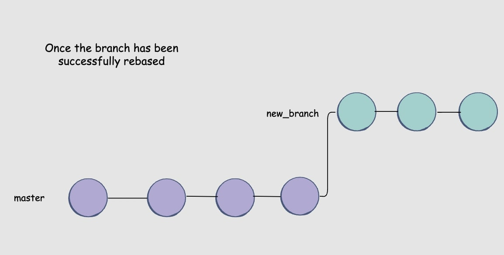


It may have occured to you that when rebasing (like merging) there is the possibility of conflicts. This occurs when the rebase branch has commits that change the same files as your current branch. The process for resolving this is almost identical to solving a merge conflict. Since we have seen how that process works, for now it will be skipped but I challenge the reader to try and create this scenario in Git-Test and resolve a conflict. 

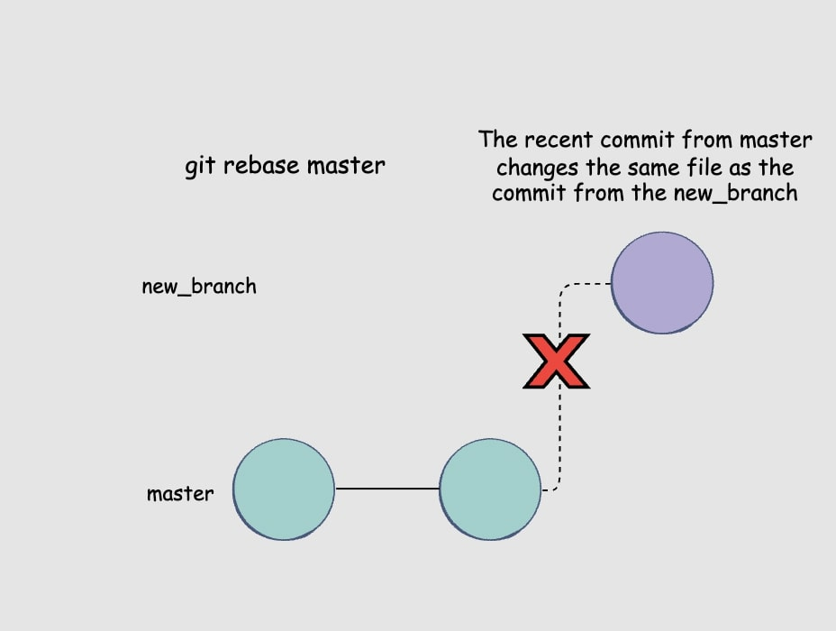

Let's quickly look at some of the main differences between `git rebase` and `git merge`:

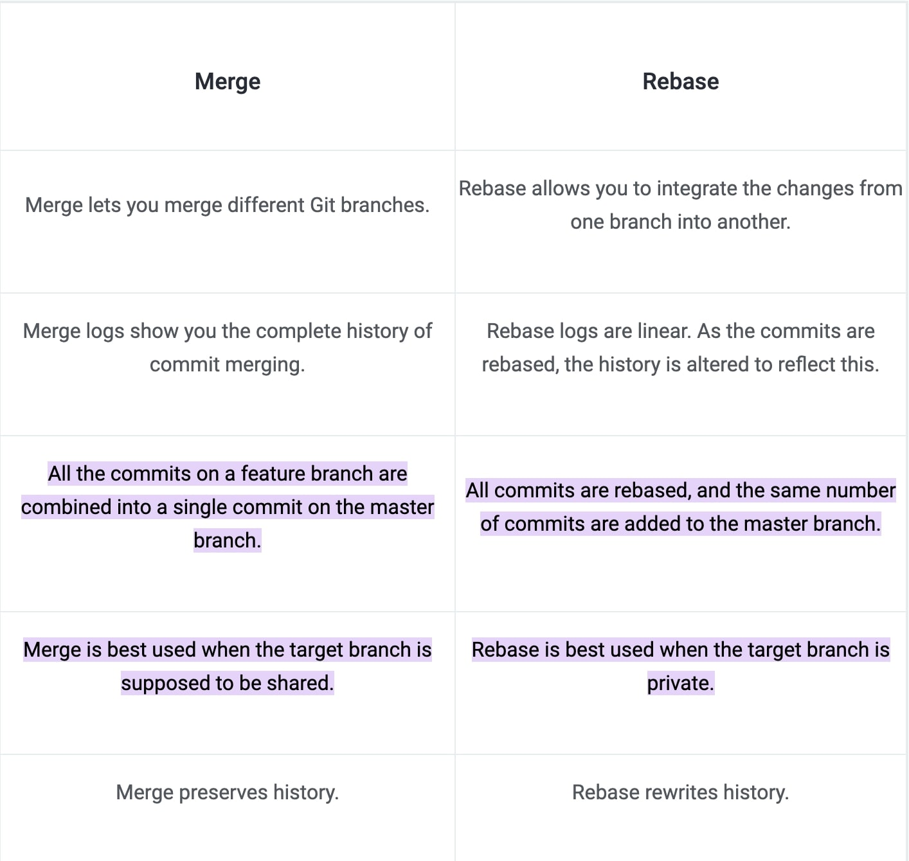


<br/><br/>


## 9. Sources and Further Reading
* An incredible open-source MIT lecture and page about Git and Github. Goes very in depth about Git's data model and inspired alot of this writing. Visit this page [here](https://missing.csail.mit.edu/2020/version-control/).

* UCSB CS156 recources created by Professor Phil Conrad. Visit the Git page [here](https://ucsb-cs156.github.io/topics/git/) and the GitHub page [here](https://ucsb-cs156.github.io/topics/GitHub/).

* `Git from the Bottom Up` book by John Wiegly simplfies the Git model and provides another indepth look at the staging area. Visit it [here](https://jwiegley.github.io/git-from-the-bottom-up/).

* An educative.io course that is a very beginner friendly look Git. Visit it [here](https://www.educative.io/courses/guide-to-git-and-version-control).

* These are the actual GitHub docs and are the best and most updated source when it comes to Git and GitHUb. Definetly give this site a try if a topic you wanna learn more about was not present. Visit this page [here](https://docs.github.com/en).

* Diagram at the end and recources about git rebase vs merge [here](https://www.simplilearn.com/git-rebase-vs-merge-article#:~:text=All%20the%20commits%20on%20a,the%20target%20branch%20is%20private.).


