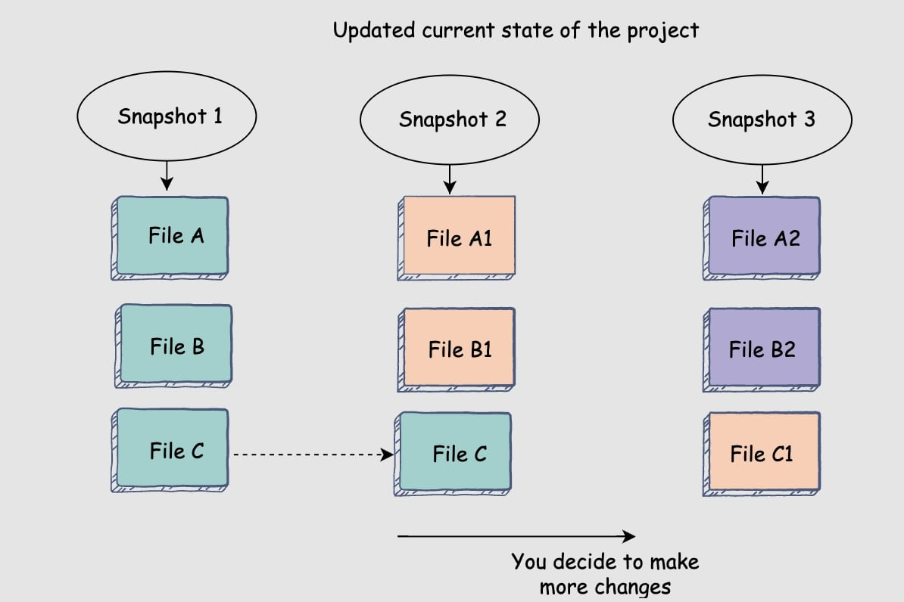

## 0. Table of Contents
1. Background  
* the whats and whys of version controls systems. 

2. Git Setup and Configuration
* setting up git 
* git config

3. Basic Git Workflow - Locally 
 * blobs and trees
 * git init and .git 
 * git add 
 * git status
 * git commit 
 * git log 
 * git reset, git restore, and git revert

4. Branching and Merging

5. Git's Data Model 
    * relating snapshots
    * git objects
    * object representation
    * SHA-1 hash
    * references

6. Remote Repositories

7. Rebasing Branches

8. Sources and Further Reading 

<br/><br/>

## 1. Background  

In this module, we will dive into an often overlooked, yet extremely crucial aspect of software design: version controls systems (VCSs). A VCS tracks the history of changes to a file or set of files over time. The most common type is a centralized VCS, which uses a server to store all the versions of a file. Some common VCSs include `Mercurial`, `Apache Subversion `, and `Beanstock`, but the reigning champion of version control and VCS used in this module is `Git`. Although Git is underlyingly beautiful, its user interface is a leaky abstraction: its tidiness and simplicity doesn't hide the details it is meant to hide, often leading to confusion and misunderstandings amongst users. Hopefully this module will clear the air with Git, enabling you fully understand what is happening the next time you commit code.  

***Why should I care about VCSs?*** <br/>
In a collaborative setting, it is extemely important to know the whos, whens and whys of a project for effiency and debugging purposes. By allowing teams to upload files,  access corresponding metadata, quickly compare versions, and even restore a previous version, VCSs have become a necessity in all modern team-based software development settings. Even when working individually, VCSs can help you remember why something was changed, and give you the ability to work in parallel on different features. 

<br/><br/>

## 2. Git Setup and Configuration 

If you have never used Git before, use this [link](https://git-scm.com/book/en/v2/Getting-Started-Installing-Git) and install Git for your operating system. To ensure correct installation of git, run `git --version` in your terminal, and you should see the version number of Git you just installed. 

Now let's set our credentials so our identity is linked to our changes. There are 3 different configuration levels for Git: 
1. System-wide: configurations will apply to all users on that device's repositories.

2. Globally: configurations will apply to only the current logged in user's repositories.

3. Locally: configurations will only apply to the working repository.

To set up your name or email globally for Git, use the following commands:
```bash
git config --global user.email "youremail@ucsb.edu"
git config --global user.name "yourname"
```
Try running `git config list` to see your system, global, and (if inside a repository) local configs. 

<br/><br/>

## 3. Basic Git Workflow - Locally 

Lets look at how to create a new project and allow for git to track it locally. First, copy and paste the block of commands in your terminal from your prefered workspace directory and hit enter: 
```bash 
mkdir git_test && \
cd git_test && \
touch file1.txt && \
mkdir foo && \
touch foo/file2.txt 
```
***What did I just do?*** <br/>
You created a file structure inside your prefered directory that looks like:


In Git, a file is also called `blob` and a directory is called a `tree`. 

Now lets initialize git so we can track git_test and all of its contents:
```bash 
git init 
```
The `git init` command does not save immediately save a version of  git_test, but instead creates a folder called `.git` inside the root folder that will eventually be full of files and subdirectories that will hold all metadata that Git needs to track the project. Now our file structure looks like: 


***Why can't I find a .git file under git_test?*** <br/>
Hidden files, (they usually files that start with a .), are helpful in preventing accidental deletion of important data. The user should not interact with the metadata git is storing, so it makes sense for it to be hidden. However, you can run `ls -a` to see visible and invisible files and directories. 

Now our project has an empty .git, ready to track the state of our project. Now enter the following command in your git_test (root) directory: 
```bash
git add .
```
Now all blobs and trees in the git_test directory are being tracked by Git in the .git file. Note the . after add. This indicates we want git to track everything modified or added from our current root directory. If, for example, I only wanted to start tracking file2.txt, I would type `git add foo/file2.txt`.  To verify these results, try:
```bash 
git status 
```
Git status is extremely useful. It shows, which files being tracked (also called staged files or changes to be committed), which files are not being tracked (changes not staged for commit) and also commits as well as which branch you are working on (we will get to this).


Now lets create a `snapshot` of git_test. A `snapshot` is just a manifest of what all of the tracked blobs and trees in your project look like at that point. The most recent snapshot of your repository is called the `HEAD`, which dynamically changes as you create snapshots through `commits`. To take a snapshot of git_test, run the following command from the git_test directory: 
```bash 
git commit -m "<yourinitials> - Initial commit"
```
***What is this -m and message?*** <br/>
The `-m` flag allows you to tag a message associated with your snapshot, which can be extremely useful when debugging, as it allows you to remember what you specifically accomplished in that snapshot. It is also good idea to put your initials in team settings, so others can easily spot who made the commit. Making these as descriptive as possible can save alot of time.


Now enter `echo "Hello, Git" >> file1.txt`into your terminal and create another snapshot by first adding and then commiting, this time with message `yourinitials - Added Hello, Git to file1.txt`. Entering the command `git log` into your terminal should now show you both your snapshots (or commits) chronologically ordered: complete with the current HEAD, author, timestamp, and even commit messages of your snapshots. `git log` is also extremely useful in collaborative settings, since it also shows the snapshots of all contributors. Hit q to quit the git log process. 
 <br/>



***What is this 40 character long string of characters next to my commit when I run git log?*** <br/>
Good question, we will take a look at that in the Git's Data Model section.

Great. We can now update our code and save it as snapshots as we go along and add features. But what if we make a mistake? A few example of what a mistake could be is: deleting a file, creating a bug or accidently running `rm -rf *` in the source directory instead of the build directory. Part of why we we're using a VCS is to be able to fix these problems quickly, and sure enough, Git provides a multitude of way to do so. Let's look at one common approach to fixing our mistake. First lets pretend we accidently wiped out our entire git_test project, and then staged and committed our code. For convience, you can copy the follow commands and enter them from git_test: 
```bash 
rm -rf * && \
git add . && \
git commit -m "Accidently deleting my whole project" 
```
Run `ls` then `git log` to make sure your git_test directory is empty and the commit where you deleted everything exists. We will now use `git reset` along with some tags to revert back to an old commit. It worth mentioning running just `git reset`  will unstage all files (or a few depending if file paths are specified). There are two main routes we using `git reset`:

1. using the `--soft flag` changes the state of most recently commited files to staged, so all changes made are preserved. 
2. using the `--hard flag` completely gets rid of the most recently commited files, so all changes made are lost. 

For our example, lets use the hard flag. Enter this command this from your git_test repository:
```bash
git reset --hard HEAD~1
```
Let's first break this the `HEAD~1` arguement down. `HEAD`refers to what we want to reset (the most recent snapshot). The `~1` indicates how many commit back we want to go. Putting these together `HEAD~1` means we want the new `HEAD` to be the commit 1 before the original `HEAD`. After running this command, you should see all the expected files from the last commit are back in git_test. Note that running `git log` no longer shows the commit in where we deleted everything.

***What is the difference between git reset, git restore and git revert?*** <br/>
The use cases somewhat overlap but their are subtle differences. `git reset` is about updating your branch by moving the HEAD to a previous commit, losing the original commit in the process of doing so. It is also used to restore staged files (this overlaps with git restore). `git restore` is about restoring files from either the staged area or from another commit. `git revert` is about making a new commit that reverts changes made by other commits. Note that git revert and git reset alter git history, whereas restore does not. 

Awesome. You can now locally use git to save snapshots of you projects and if you do make a mistake, it's not the end of the world. 

<br/><br/>

## 4. Branching and Merging

<br/><br/>

## 5. Git's data model
Now lets dive a little deeper into how that aforementioned .git file is actually relating and storing all these snapshots from potentially multiple branches. A history of a repositoritory is a directed acyclic (no-cycle) graph (or DAG for short) of snapshots, where each snapshot refers to a set of parent snapshots that precede it. When two branches merge is an example of when one snapshot will have 2 parents. Let's quickly look at an example DAG commit history, where the arrows represent the chronology of snapshots. 


In the above example, all snapshots have only 1 parent in their set: the snapshot before itself. In this example, let's say snapshots 1-4 are on branch master, whereas snapshots 5-6 are on branch development. Let's create a merge commit. Now our commit history looks like: 


Now snapshot #7 has two parents associated with itself: snapshot #6 and snapshot #4. Commits in git are immutable: edits to the commit history either create new commits or update references to point to other commits (we will get to references in a second).

Now that we understand how snapshots are related, lets get into Git's underlying data structure by using UCSB's language of choice, C++, as a modeling tool. Note that a blob (or file) is an array of bytes and a tree (or folder) is a map to either blob or another tree. Keep in mind the below representation is a model. 
```c++
//A blob is an array or vector of bytes
struct blob {
    vector<bytes> ablob;
}
//A tree is a map that contains more trees and/or blobs
struct tree {
    vector<blob> blobsInTree;
    map<string, vector<string> > treesInTree;
    
}
//A commit is a set of parents, a string author, a string message, and a tree  
struct commit {
    set<tree> parents;
    string author;
    string message;
    tree snapshot; //this is the top level tree
}
```
These `blob`. `tree`, and `commit` data types are all `objects` in the eyes of Git. If you add a blob or tree or create a commit, Git uses what's called a `SHA-1 hash` to idenitfy each object for storing and loading. Even when objects reference other objects, they don’t actually contain them in their on-disk representation, but instead use the other objects hash as a reference. The `SHA-1 hash` is literally a string of 40 hexadecimal characters, and is used since it is a secure and integral way to a uniquely content-address each object. Read more about SHA-1 hashing [here](https://www.geeksforgeeks.org/sha-1-hash-in-java/). 

Most people have trouble memorizing 40 hexadecimal character, so git came up with the idea of `references`. `References` are like C++ pointers, but they only`point to commits`. References are mutable: they can be updated to point to a new commit (unlike objects). An example of a reference is the `master` or `main` branch that usually points to the latest production ready commit. Remember early when we used `git reset --hard HEAD~1`? What we were actually doing was changing the "where we currently are" reference, or `HEAD` to point to a previous commit. You can also substiute `HEAD~1` with any commit. Lets say we are on the master branch and want the `master` ref to point to commit `6f21v1e`, and we do not care about uncommited changes. We could would enter the follow from our root directory:
 ```bash
 git reset --hard 6f21v1e
 ```


<br/><br/>

## 6. Remote Repositories

<br/><br/>

## 7. Rebasing Branches

<br/><br/>

## 8. Further Reading


