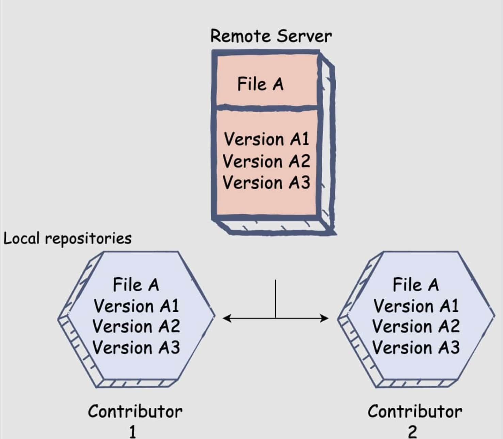

## Background 
In this module, we will dive into an often overlooked, yet extremely crucial aspect of software design: version controls systems (VCSs). A VCS tracks changes to a file or set of files over time. The most common type is a centralized VCS, which uses a server to store all the versions of a file. Some common VCSs include `Mercurial`, `Apache Subversion `, and `Beanstock`, but the reigning champion of version control and VCS used in this module is `Git`. Although Git is underlyingly beatiful, its user interface is a leaky abstraction: its tidiness and simplicity doesn't hide the details it is meant to hide, often leading to confusion and misunderstandings amongst users. Hopefully this module will clear the air with Git, enabling you fully understand what is happening the next time you push code.  

***Why should I care about VCSs?***  
In a collaborative setting, it is extemely important to know the whos, whens and whys of a project for effiency and debugging purposes. By allowing teams to upload files and metadata, track all changes to assets, quickly comparing versions, and even restoring to a previous version, VCSs have solved alot of these issues and have become a necessity in all modern team-based software development settings. 

## Git Models

## Further Reading

